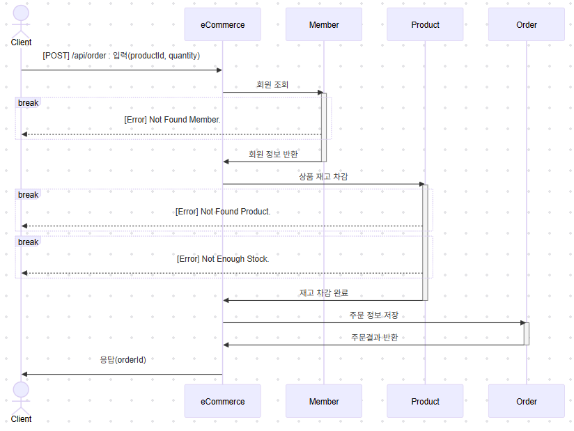
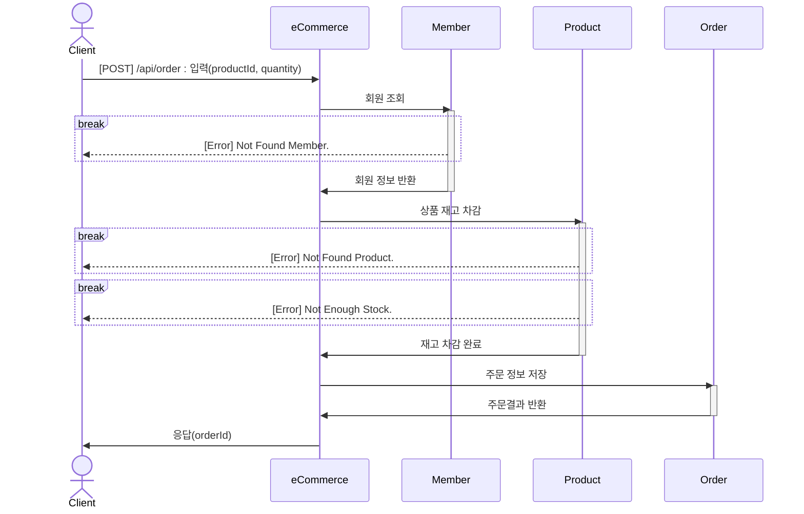

# 시퀀스 다이어그램

## 주문 접수 API

```mermaid
sequenceDiagram
    actor Client
    participant eCommerce
    participant Member
    participant Product
    participant Order

    Client->>eCommerce: [POST] /api/order : 입력(productId, quantity)
    
    eCommerce->>Member: 회원 조회
    activate Member
    break 
        Member-->>Client: [Error] Not Found Member.
    end 
    Member->>eCommerce: 회원 정보 반환
    deactivate Member

    
    eCommerce->>Product: 상품 재고 차감
    activate Product
    break 
        Product-->>Client: [Error] Not Found Product.
    end
    break
        Product-->>Client: [Error] Not Enough Stock.
    end
    Product->>eCommerce: 재고 차감 완료
    deactivate Product

    
    eCommerce->>Order: 주문 정보 저장
    activate Order
    Order->>eCommerce: 주문결과 반환
    deactivate Order

    eCommerce->>Client: 응답(orderId)
```

## 결제 API
