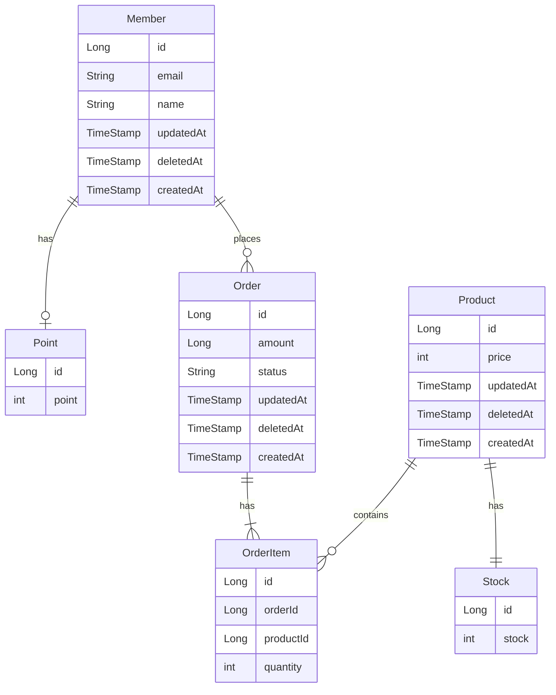

# Entity Relation Diagram Script

```mermaid
erDiagram
    Member{
        Long id
        String email
        String name
        TimeStamp updatedAt
        TimeStamp deletedAt
        TimeStamp createdAt
    }
    Point{
        Long id
        int point
    }
    Order{
        Long id
        Long amount
        String status
        TimeStamp updatedAt
        TimeStamp deletedAt
        TimeStamp createdAt
    }
    OrderItem{
        Long id
        Long orderId
        Long productId
        int quantity
    }
    Product{
        Long id
        int price
        TimeStamp updatedAt
        TimeStamp deletedAt
        TimeStamp createdAt
    }
    Stock{
        Long id
        int stock
    }
    Member ||--o{ Order : places
    Member ||--o| Point : has
    Order ||--|{ OrderItem : has
    Product ||--o{ OrderItem : contains
    Product ||--|| Stock : has

```